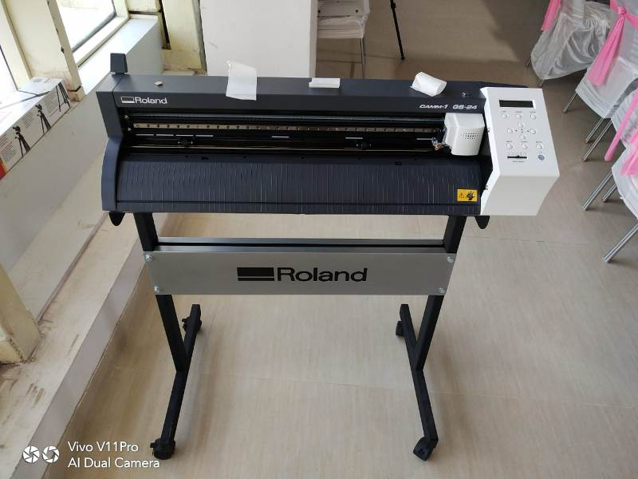

# Vinyle Cutter

# Vinyl Cutter Safety

## Dos
1) You SHALL wear closed-toe shoes at all times.
2) You SHALL clean up your space after every job session, and leave 10-15 minutes for cleanup prior to shop closure.
3) You SHALL clear the area around the cutter before turning on the machine.
4) You SHALL always handle the blade carefully.

## Donts

1) You SHALL NOT leave a machine unattended while in operation.
2) You SHALL NOT use liquids, metals, or flammable objects inside the cutter.
3) You SHALL NOT place hands or other objects in the path of the cutting arm while the job is in session.
4) You SHALL NOT lean on the machine.
5) You SHALL NOT wear ties, belts, or leave hair down while cutting arm is in operation.

## Operating Procedure

1)Hold the blade carefully and Place the blade in the blade holder so that the The Tip of the blade should be at optimum position in the blade holder.Place lace the blade holder in the blade holding assembly by tightening the blade holding Knob.Do not tighten the knob with great force.Tighten it gently.

3)Load the vinyl sheet roll by pushing it through the machine by gentle force and set the rollers at the optimum position within the marks and lock the liver

3)Now power on the machine and select the material type by up-down keys and select roll and pres enter.Now set the origin by using the up-down and right-left  keys by moving the blade holding assembly and set the origin by press and holding the set button.

4)Set the force to 80 gf and press enter and press test button to cut the test image.the image is cut in 3 pattern and each pattern should peel off one by one.if not the follow step 1.

5)Now Download and insall the inkscape software andclick on file ->document properties and  set the width and height to 150x50 mm. and type the cutting image and export as name the file and location and click export button.

6)Now create the .camm file of the .png image by opening the http://www.fabmodules.org and select input format image.png and select the png file.Now select the output format to roland vinyl.camm file and set force to 80 gf and velocity to 20 cm/sec and select process to cut venyl. and click calculate and save.
For simple process we can use cut studio.

7)After processing the cut image through vinyl cutter use the transfer tape to paste the cut image to the srface.
